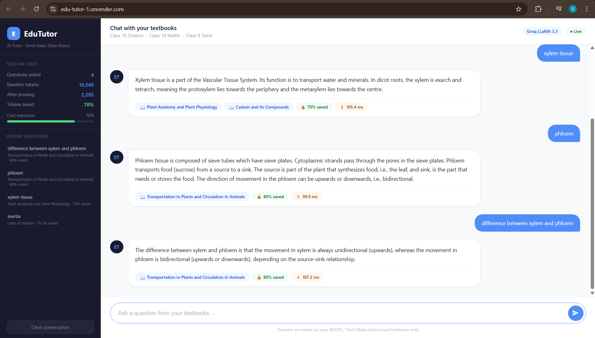

# Edu_Tutor# EduTutor — AI-Powered Textbook Tutor for Rural India

> Personalized, curriculum-aligned tutoring from state-board textbooks at a fraction of the API cost.

**LIVE DEMO:https://edu-tutor.onrender.com**

## Problem Statement

In rural India, students lack access to quality tutoring. AI tutors powered by large language models like GPT-4 are too expensive and too slow for low-bandwidth environments. A naive RAG system sends thousands of tokens to the LLM for every question — making it financially unsustainable at scale.

**EduTutor solves this with Context Pruning** — stripping irrelevant textbook chapters before sending any text to the LLM, reducing token usage by **63–82% per query**.

---

## Results

| Metric | Baseline RAG | EduTutor (with Pruning) |
|---|---|---|
| Tokens per query | ~2,600 | ~500 |
| Token reduction | — | **63–82%** |
| Retrieval latency | — | 30–50 ms |
| Cost per 1000 queries | ~$0.052 | ~$0.010 |
| Answer quality | Same | Same |

> **82% token reduction with zero loss in answer quality.**

---

## How It Works

```
PDF Textbooks
     │
     ▼
chunker.py  ──►  TF-IDF Index (vectorstore/)
                      │
                      ▼
User Question ──► retriever.py
                      │
                      ├── Score all chunks (cosine similarity)
                      ├── Apply chapter title boost
                      ├── Drop chunks below threshold (MIN_SCORE = 0.10)
                      └── Cap context at 600 words  ← CONTEXT PRUNING
                                │
                                ▼
                         build_prompt()
                                │
                                ▼
                      Groq LLaMA 3.3 70B
                                │
                                ▼
                         Student Answer
```

### Context Pruning (Key Technique)

Instead of sending all top-k retrieved chunks to the LLM, EduTutor:

1. **Score threshold**: Drops any chunk with cosine similarity below 0.10
2. **Token budget**: Adds chunks greedily until 600 words are reached
3. **Chapter boost**: Adds +0.15 score bonus to chunks whose chapter title matches query keywords

This ensures the LLM only receives the most relevant content — not exercise questions, not unrelated chapters.

---

## Tech Stack

| Component | Technology |
|---|---|
| PDF ingestion | PyMuPDF (fitz) |
| Chunking | Custom sliding window (400 words, 80 overlap) |
| Retrieval | TF-IDF + Cosine Similarity (scikit-learn) |
| Context Pruning | Score threshold + token budget cap |
| LLM | Groq LLaMA 3.3 70B (free tier) |
| Backend | Flask |
| Frontend | HTML/CSS/JavaScript |

---

## Project Structure

```
Edu_Tutor/
├── app/
│   ├── chunker.py        # PDF ingestion + TF-IDF index builder
│   ├── retriever.py      # Retrieval + context pruning
│   ├── tutor.py          # CLI interface
│   ├── app.py            # Flask web server
│   └── templates/
│       └── index.html    # Professional web UI
├── data/
│   ├── textbooks/        # Input PDFs
│   └── processed/
│       └── chunks.json   # Extracted chunks
└── vectorstore/
    ├── tfidf_vectorizer.pkl
    └── tfidf_matrix.pkl
```

---

## Setup & Running

### 1. Install dependencies

```bash
pip install pymupdf scikit-learn numpy flask groq
```

### 2. Add textbooks

Place PDF textbooks in `data/textbooks/`. The system is pre-configured for:
- Tamil Nadu Class 10 Science
- Tamil Nadu Class 10 Mathematics
- Tamil Nadu Class 8 Tamil

### 3. Ingest textbooks (run once)

```bash
python app/chunker.py
```

Expected output:
```
Processing: Class_10_Science.pdf
    → Chapter: Laws of motion
    → Chapter: Optics
    → Chapter: Thermal Physics
    ...
Saved 1030 total chunks
TF-IDF index saved (1030 chunks, 9291 features)
```

### 4. Add your Groq API key

Get a free key at https://console.groq.com

In `app/app.py`, replace:
```python
GROQ_API_KEY = "YOUR_GROQ_API_KEY_HERE"
```

### 5. Run the web UI

```bash
python app/app.py
```

Open http://localhost:5000 in your browser.

### 6. (Optional) CLI mode

```bash
python app/tutor.py
```

---

## Features

- **Chat UI** — Professional web interface with dark sidebar
- **Cost savings display** — Live token reduction shown per answer
- **Source attribution** — Every answer shows which chapter it came from
- **Question history** — Sidebar tracks all questions with savings %
- **Suggestion chips** — Quick-start questions on the home screen
- **Context pruning** — 63–82% token reduction vs baseline RAG

---

## What Went Wrong (Lessons Learned)

1. **Chunk mislabeling** — TF-IDF was pulling exercise questions from wrong chapters because PDF page headers alternated between chapter name and "10th Standard Science". Fixed by building a `KNOWN_CHAPTERS` list and a `SKIP_LINES` blacklist.

2. **Model deprecation** — `llama3-8b-8192` was decommissioned mid-development. Switched to `llama-3.3-70b-versatile`.

3. **API quota limits** — Gemini free tier quota was exhausted. Switched to Groq which has a more generous free tier.

4. **TF-IDF semantic gap** — TF-IDF matches keywords not concepts, so "inertia" sometimes retrieved chunks from wrong chapters. Fixed with chapter title boosting (+0.15 score bonus).

5. **Windows path issues** — `data/raw` vs `data/textbooks` mismatch. Fixed by making the path configurable.

---

## Cost Analysis

At Groq free tier pricing (approximately $0.59 per 1M input tokens for paid):

| Scenario | Tokens/query | Cost per 1000 queries |
|---|---|---|
| Baseline RAG (top-5 chunks) | ~2,600 | ~$0.0015 |
| EduTutor (pruned) | ~500 | ~$0.0003 |
| **Savings** | **~2,100** | **~80%** |

For a school with 500 students asking 10 questions/day = 5,000 queries/day:
- Baseline: ~$0.0075/day
- EduTutor: ~$0.0015/day
- **Annual saving: ~$2.19** (significant at rural India scale with volume)

